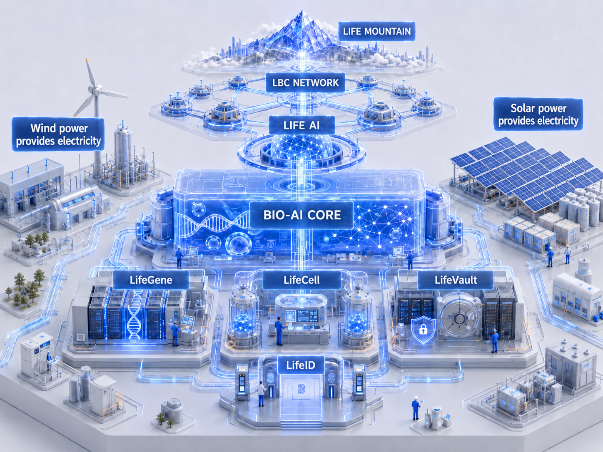

# LBC 2026 Concept Map

## Concept Image

## Concept Positioning

This image presents the future life digital infrastructure concept for LIFEBANK CHAIN. It combines Bio-AI Core, LifeID, LifeGene, LifeCell, LifeVault, LifeAI, LBC Network, and Life Mountain into a unified life technology infrastructure scene.

## Core Elements

- Life Mountain: Value governance and long-term vision for life civilization.
- LBC Network: On-chain network and decentralized collaboration infrastructure.
- LifeAI: Life intelligence analysis and decision center.
- Bio-AI Core: Bio-AI computation and multi-omics intelligence core.
- LifeGene: Genomic and life data analysis infrastructure.
- LifeCell: Cell resource and regenerative medicine infrastructure.
- LifeVault: Secure life data storage and privacy protection infrastructure.
- LifeID: User digital identity and authorization gateway.

## Energy and Infrastructure Expression

The image includes wind power, solar power, and infrastructure pipelines to express sustainable energy, compute supply, and infrastructure coordination.

## Use Cases

- Whitepaper visual concept image
- Website or introduction page hero visual
- Investor materials
- Roadmap or ecosystem blueprint explanation
- Overall project vision presentation

