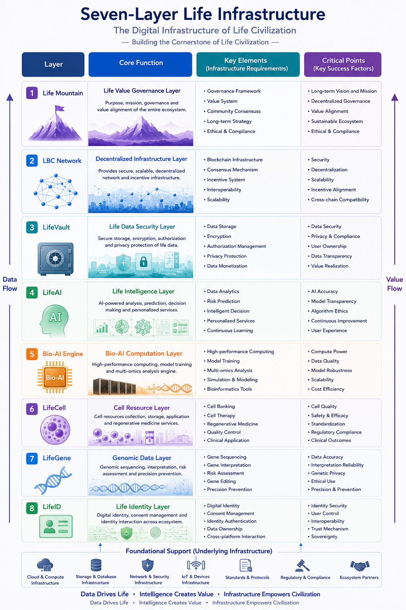

# Seven-Layer Life Infrastructure

## Architecture Diagram

## Positioning

Seven-Layer Life Infrastructure is the overall life digital infrastructure architecture of LIFEBANK CHAIN. It describes the layered relationship between governance, network infrastructure, data security, intelligence, Bio-AI computation, cell resources, genomic data, and digital identity.

The architecture emphasizes two core directions:

- Data Flow: Life data flows upward from foundational identity and biological data layers into secure, governable, analyzable, and usable digital life assets.
- Value Flow: Value flows downward from governance and ecosystem coordination into identity, genomic data, cell resources, AI, data security, and on-chain network collaboration.

## Layer Structure

### 1. Life Mountain: Life Value Governance Layer

This layer defines the purpose, mission, governance principles, and value alignment of the entire ecosystem.

Core capabilities:

- Governance framework
- Value system
- Community consensus
- Long-term strategy
- Ethics and compliance

Key success factors:

- Long-term vision and mission
- Decentralized governance
- Value alignment
- Sustainable ecosystem
- Ethics and compliance

### 2. LBC Network: Decentralized Infrastructure Layer

This layer provides secure, scalable, and decentralized network and incentive infrastructure.

Core capabilities:

- Blockchain infrastructure
- Consensus mechanism
- Incentive system
- Interoperability
- Scalability

Key success factors:

- Security
- Decentralization
- Scalability
- Incentive alignment
- Cross-chain compatibility

### 3. LifeVault: Life Data Security Layer

This layer secures life data through storage, encryption, authorization, and privacy protection.

Core capabilities:

- Data storage
- Encryption
- Authorization management
- Privacy protection
- Data monetization

Key success factors:

- Data security
- Privacy and compliance
- User ownership
- Data transparency
- Value realization

### 4. LifeAI: Life Intelligence Layer

This layer provides AI-powered analysis, prediction, decision support, and personalized services.

Core capabilities:

- Data analytics
- Risk prediction
- Intelligent decision-making
- Personalized services
- Continuous learning

Key success factors:

- AI accuracy
- Model transparency
- Algorithm ethics
- Continuous improvement
- User experience

### 5. Bio-AI Engine: Bio-AI Computation Layer

This layer supports high-performance computing, model training, multi-omics analysis, simulation, and bioinformatics processing.

Core capabilities:

- High-performance computing
- Model training
- Multi-omics analysis
- Simulation and modeling
- Bioinformatics tools

Key success factors:

- Compute power
- Data quality
- Model robustness
- Scalability
- Cost efficiency

### 6. LifeCell: Cell Resource Layer

This layer supports cell resource collection, storage, application, and regenerative medicine services.

Core capabilities:

- Cell banking
- Cell therapy
- Regenerative medicine
- Quality control
- Clinical application

Key success factors:

- Cell quality
- Safety and efficacy
- Standardization
- Regulatory compliance
- Clinical outcomes

### 7. LifeGene: Genomic Data Layer

This layer supports genomic sequencing, interpretation, risk assessment, gene editing, and precision prevention.

Core capabilities:

- Gene sequencing
- Gene interpretation
- Risk assessment
- Gene editing
- Precision prevention

Key success factors:

- Data accuracy
- Interpretation reliability
- Genetic privacy
- Ethical use
- Precision and prevention

### 8. LifeID: Life Identity Layer

This layer manages digital identity, consent management, identity authentication, and cross-ecosystem identity interaction.

Core capabilities:

- Digital identity
- Consent management
- Identity authentication
- Data ownership
- Cross-platform interaction

Key success factors:

- Identity security
- User control
- Interoperability
- Trust mechanism
- Sovereignty

## Foundational Support

Seven-Layer Life Infrastructure depends on the following foundational infrastructure:

- Cloud and compute infrastructure
- Storage and database infrastructure
- Network and security infrastructure
- IoT and device infrastructure
- Standards and protocols
- Regulatory and compliance systems
- Ecosystem partners

## Relationship to Future Documents

This architecture document acts as the entry point for later project design:

- Database design: Based on core entities such as LifeID, LifeGene, LifeCell, and LifeVault.
- System component design: Based on identity, data vault, AI engine, on-chain network, and governance modules.
- API module design: Based on identity authentication, data authorization, genomic data, cell resources, AI analysis, governance, and incentives.

