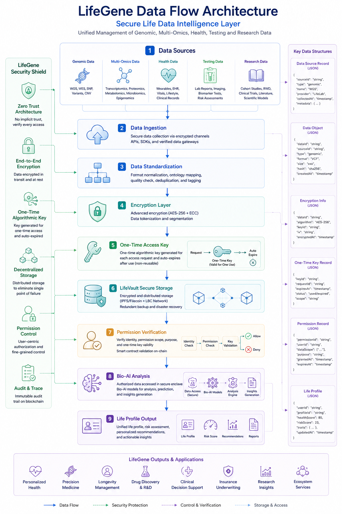

# LifeGene Data Flow Architecture

## Data Flow Design Diagram



## Positioning

LifeGene is the secure life data intelligence layer for genomic, multi-omics, health, testing, and research data in LIFEBANK CHAIN. It supports unified ingestion, standardization, encryption, authorization verification, distributed storage, and Bio-AI analysis, and ultimately produces life profile outputs for health management, precision medicine, research, and ecosystem services.

In the overall architecture, LifeGene corresponds to the `Genomic Data Layer` and works with LifeID, LifeVault, Bio-AI Engine, LifeAI, and LBC Network.

## LifeGene Security Shield

Core mechanisms include Zero Trust Architecture, End-to-End Encryption, One-Time Algorithmic Key, Decentralized Storage, Permission Control, and Audit and Trace.

## Data Flow Steps

1. Data Sources: Genomic, multi-omics, health, testing, and research data.
2. Data Ingestion: Data is collected through encrypted channels, secure APIs, SDKs, and verified data gateways.
3. Data Standardization: Format normalization, ontology mapping, quality checks, deduplication, and tagging.
4. Encryption Layer: AES-256 and ECC encryption, data tokenization, and data segmentation.
5. One-Time Access Key: A one-time key is generated for each access request and expires after use.
6. LifeVault Secure Storage: Encrypted and distributed storage through IPFS, Filecoin, and LBC Network.
7. Permission Verification: Identity, permission, scope, purpose, and one-time key validity are verified on-chain.
8. Bio-AI Analysis: Authorized data is analyzed by Bio-AI models in a secure environment.
9. Life Profile Output: The system generates life profiles, risk scores, recommendations, and reports.

## Key Data Structures

### Data Source Record

```json
{
  "sourceId": "string",
  "type": "genomic",
  "name": "WGS",
  "provider": "LifeLab",
  "collectedAt": "timestamp",
  "metadata": {}
}
```

### Data Object

```json
{
  "dataId": "string",
  "sourceId": "string",
  "type": "genomic",
  "format": "VCF",
  "size": "xxx",
  "hash": "sha256",
  "createdAt": "timestamp"
}
```

### Encryption Info

```json
{
  "dataId": "string",
  "algorithm": "AES-256",
  "keyId": "string",
  "iv": "string",
  "encryptedAt": "timestamp"
}
```

### One-Time Key Record

```json
{
  "keyId": "string",
  "requestId": "string",
  "expiresAt": "timestamp",
  "status": "used/expired",
  "scope": "string"
}
```

### Permission Record

```json
{
  "permissionId": "string",
  "userId": "string",
  "dataScope": [],
  "purpose": "string",
  "grantedAt": "timestamp",
  "expiresAt": "timestamp"
}
```

### Life Profile

```json
{
  "userId": "string",
  "profileId": "string",
  "healthScore": 85,
  "riskScore": 23,
  "traits": [],
  "updatedAt": "timestamp"
}
```

## Outputs and Application Scenarios

LifeGene outputs can be used for Personalized Health, Precision Medicine, Longevity Management, Drug Discovery and R&D, Clinical Decision Support, Insurance Underwriting, Research Insights, and Ecosystem Services.

## Flow Types

The diagram includes Data Flow, Security Protection, Control and Verification, and Storage and Access.

## Relationship to Other Design Documents

- LifeID: Provides user identity, authorization subjects, and permission control foundations.
- LifeVault: Provides encrypted storage, distributed storage, and secure access.
- Bio-AI Engine: Performs multi-omics analysis, model inference, and insight generation.
- LBC Network: Provides on-chain permission validation, audit trails, and trusted records.
- API module design: Can be expanded into data ingestion, data authorization, key request, permission verification, analysis task, and report query APIs.

