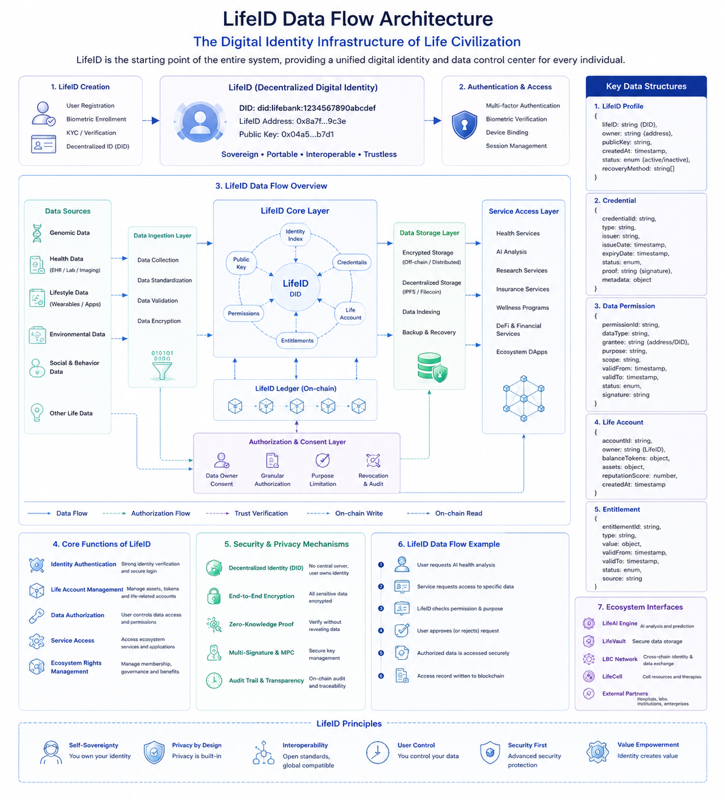

# LifeID Data Flow Architecture

## Data Structure Diagram



## Positioning

LifeID is the life identity infrastructure of LIFEBANK CHAIN and the starting point of the entire system. It provides each individual with a unified decentralized digital identity, data control center, authorization gateway, and cross-ecosystem access foundation.

In the overall architecture, LifeID corresponds to the `Life Identity Layer`. It supports LifeGene, LifeCell, LifeVault, LifeAI, LBC Network, and other modules through data ownership, authorization, access control, and value circulation.

## Core Flow

### 1. LifeID Creation

The LifeID creation flow includes:

- User registration
- Biometric enrollment
- KYC and identity verification
- Decentralized identity DID generation

The generated LifeID contains DID, LifeID Address, Public Key, and sovereign, portable, interoperable, and trustless identity attributes.

### 2. Authentication and Access

LifeID access control supports multi-factor authentication, biometric verification, device binding, and session management. This layer ensures that access requests come from legitimate identity subjects and establishes a trusted context for data authorization and service access.

## Data Flow Overview

LifeID aggregates genomic data, health data, lifestyle data, environmental data, social and behavior data, and other life-related data.

The data ingestion layer is responsible for data collection, standardization, validation, and encryption.

The LifeID core layer is centered on DID and links Identity Index, Credentials, Life Account, Entitlements, Permissions, and Public Key.

LifeID Ledger acts as the on-chain record layer for trusted identity, permission, audit, and access records.

The authorization and consent layer supports data owner consent, granular authorization, purpose limitation, revocation, and audit.

The data storage layer supports encrypted storage, decentralized storage such as IPFS and Filecoin, data indexing, backup, and recovery.

Authorized data can be accessed by ecosystem services such as Health Services, AI Analysis, Research Services, Insurance Services, Wellness Programs, DeFi and Financial Services, and Ecosystem DApps.

## Key Data Structures

### LifeID Profile

```text
lifeID: string (DID)
owner: string (address)
publicKey: string
createdAt: timestamp
status: enum (active/inactive)
recoveryMethod: string[]
```

### Credential

```text
credentialId: string
type: string
issuer: string
issueDate: timestamp
expiryDate: timestamp
status: enum
proof: string (signature)
metadata: object
```

### Data Permission

```text
permissionId: string
dataType: string
grantee: string (address/DID)
purpose: string
scope: string
validFrom: timestamp
validTo: timestamp
status: enum
signature: string
```

### Life Account

```text
accountId: string
owner: string (LifeID)
balanceTokens: object
assets: object
reputationScore: number
createdAt: timestamp
```

### Entitlement

```text
entitlementId: string
type: string
value: object
validFrom: timestamp
validTo: timestamp
status: enum
source: string
```

## Core Functions

LifeID provides Identity Authentication, Life Account Management, Data Authorization, Service Access, and Ecosystem Rights Management.

## Security and Privacy Mechanisms

LifeID security mechanisms include Decentralized Identity, End-to-End Encryption, Zero-Knowledge Proof, Multi-Signature and MPC, and Audit Trail and Transparency.

## Data Access Example

1. The user requests AI health analysis.
2. The service requests access to specific data.
3. LifeID checks permission and purpose.
4. The user approves or rejects the request.
5. Authorized data is accessed securely.
6. The access record is written to the blockchain.

## Ecosystem Interfaces

LifeID connects with LifeAI Engine, LifeVault, LBC Network, LifeCell, and external partners such as hospitals, laboratories, institutions, and enterprises.

## Design Principles

LifeID follows Self-Sovereignty, Privacy by Design, Interoperability, User Control, Security First, and Value Empowerment.

## Relationship to Other Design Documents

- Architecture design: Corresponds to the LifeID layer in Seven-Layer Life Infrastructure.
- Database design: Can be expanded into entity models such as LifeID Profile, Credential, Data Permission, Life Account, and Entitlement.
- System component design: Can be split into DID service, authentication service, authorization service, ledger writing service, and data indexing service.
- API module design: Can be expanded into identity creation, authentication, authorization, revocation, access audit, and ecosystem service integration APIs.

